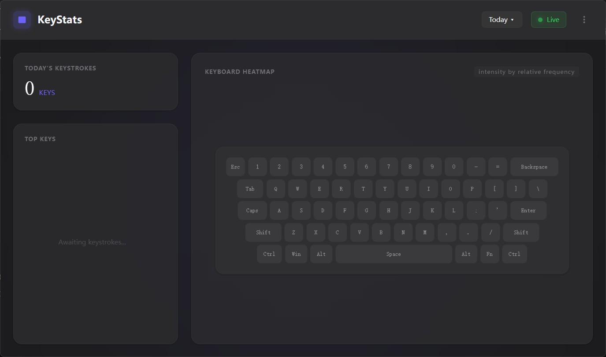

# KeyStats

Real-time keyboard usage tracker for Windows. Beautiful, minimal, and stays out of your way.



## Features

- **Global keystroke capture** — low-level Windows hook (`WH_KEYBOARD_LL`), works across all apps
- **Live dashboard** — total keystrokes, top 10 keys ranking, interactive QWERTY heatmap
- **Date range stats** — switch between Today, Yesterday, Last 7 Days, and Last 30 Days
- **System tray** — minimize to tray, show/quit from tray menu
- **Elegant menus** — `⋯` dropdown + top-bar right-click context menu
- **Persistent window size** — remembers your last resized dimensions
- **Custom modal dialogs** — dark glassmorphism alerts that match the app theme
- **Font configuration** — choose any installed monospace font from Settings (reads system fonts automatically)
- **Reset stats** — one-click clear all records with confirmation
- **Comprehensive key mapping** — F1-F24, arrows, media keys, Fn, L/R modifiers, and more
- **Zero-config storage** — SQLite with WAL mode at `%APPDATA%/key-stats/data.db`

## Tech Stack

| Layer | Technology |
|-------|------------|
| Desktop framework | Wails v2 |
| Backend | Go 1.25+, modernc.org/sqlite |
| Frontend | Svelte 4, Vite 5 |
| Styling | Tailwind CSS 3 |
| Package manager | Bun |
| System tray | getlantern/systray |

## Project Structure

```
key-stats/
├── main.go                    # Entry point (embed + wails.Run)
├── wails.json                 # Wails config (bun scripts, version, product info)
├── go.mod / go.sum
├── scripts/
│   ├── build.ps1              # Production build script (PowerShell)
│   ├── gen_ico.go             # Multi-size ICO generator (from PNG source)
│   └── Clear-IconCache.ps1    # Helper: clear Windows icon cache
├── build/
│   ├── appicon.png            # Source icon for ICO generation
│   └── windows/
│       ├── icon.ico           # Windows multi-size icon (embedded into .exe)
│       └── wails.exe.manifest # Windows manifest
├── frontend/
│   ├── package.json           # Bun scripts + dev dependencies
│   ├── vite.config.js
│   ├── tailwind.config.js
│   ├── index.html
│   └── src/
│       ├── main.js            # Svelte entry point
│       ├── app.css            # Global styles + CSS font variable
│       ├── App.svelte         # Main layout, title bar, menus, modals, polling loop
│       └── components/
│           ├── KeyboardMap.svelte   # QWERTY heatmap with auto-scaling
│           ├── Modal.svelte         # Glassmorphism dialog (info/confirm)
│           └── SettingsPanel.svelte # Theme, font, startup toggles
├── internal/
│   ├── config/
│   │   └── config.go          # .env-based config + window size persistence
│   ├── db/
│   │   └── sqlite.go          # SQLite init + batch writer goroutine
│   ├── models/
│   │   └── models.go          # KeyEvent, TodaySummary structs
│   ├── service/
│   │   └── keyboard.go        # Win32 LL hook + message pump goroutine
│   └── stats/
│       └── stats.go           # VK code → key name mapping
├── pkg/
│   ├── app/
│   │   ├── app.go             # App struct, lifecycle, API bindings, window icon fix
│   │   └── drag_windows.go    # Native window drag (frameless)
│   └── tray/
│       └── tray_windows.go    # System tray icon + menu
└── docs/
    └── releases/
        └── v<version>.md      # Release notes per tag
```

## Prerequisites

- Go 1.25+
- [Bun](https://bun.sh/)
- Wails CLI: `go install github.com/wailsapp/wails/v2/cmd/wails@latest`
- Windows 10/11

## Development

```powershell
# Run in dev mode (hot-reload)
wails dev

# Build production binary
.\scripts\build.ps1

# Or manually:
cd frontend && bun install && bun run build && cd ..
wails build -s
cd frontend && bun run patch:wails && cd ..
go run github.com/akavel/rsrc@latest -ico build\windows\icon.ico -o rsrc_windows_amd64.syso
go build -tags "desktop,production" -trimpath -ldflags="-H windowsgui -s -w" -o build\bin\key-stats.exe .
```

## Release

Releases are built automatically by GitHub Actions when a version tag is pushed.

```powershell
# 1. Bump version in wails.json
# 2. Write release notes: docs\releases\v1.0.2.md
# 3. Commit and push
# 4. Tag and push
git tag v1.0.2
git push --tags
```

The CI workflow compiles `key-stats.exe` and publishes it on the [Releases](https://github.com/blycr/key-stats/releases) page.

---

The `wails.json` is already configured to use `bun`:

```json
{
  "frontend:install": "bun install",
  "frontend:build": "bun run build",
  "frontend:dev:watcher": "bun run dev"
}
```

## Build Output

```
build/bin/key-stats.exe
```

## Data Storage

SQLite at `%APPDATA%/key-stats/data.db` with WAL mode enabled.

Schema auto-creates on first run:

```sql
CREATE TABLE key_events (
    id          INTEGER PRIMARY KEY AUTOINCREMENT,
    key_code    INTEGER NOT NULL,   -- Windows VK code
    app_name    TEXT    NOT NULL,   -- foreground window title
    timestamp   INTEGER NOT NULL    -- Unix epoch ms
);
```

Config file (`.env`) at `%APPDATA%/key-stats/.env`.

## Architecture

```
Win32 Hook (dedicated goroutine + message pump)
    ↓
Event Channel (buffered, cap 4096)
    ↓
Batch Writer (goroutine) — 500 ms / 256 events → SQLite (WAL)
    ↑
Real-time Events → rtChan (cap 256) → rtEmitter → runtime.EventsEmit
    ↑
Wails Frontend ←—— 500 ms poll ——→ Svelte + Tailwind
```

## License

MIT License — see [LICENSE](LICENSE).
